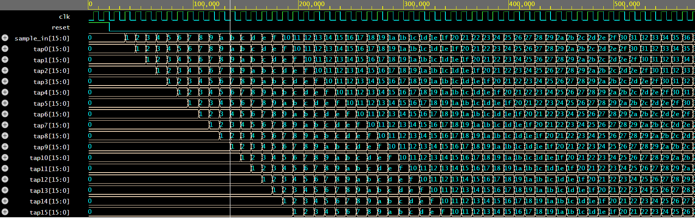
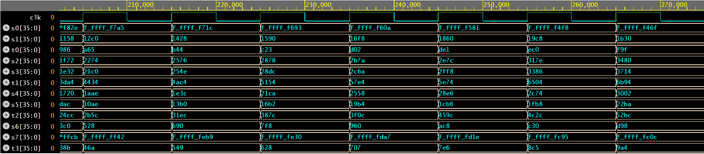
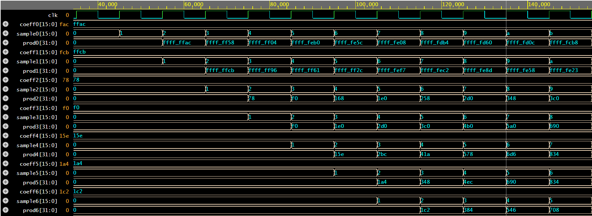
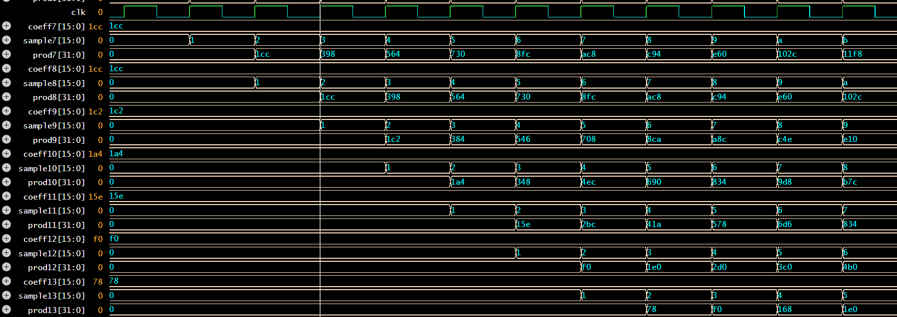
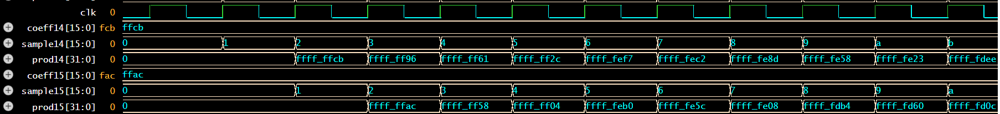
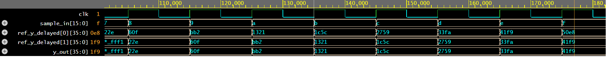

# 16-Tap FIR Filter (Verilog HDL)

This repository contains a fully-pipelined, synthesizable **16-tap FIR (Finite Impulse Response) digital filter** implemented entirely in Verilog HDL.  
The design demonstrates fixed-point DSP implementation techniques, pipelined arithmetic, a balanced adder tree, and full verification using a self-checking testbench.

---

## Table of Contents
- [Author](#author)
- [Introduction](#introduction)
- [What Is Fixed-Point Arithmetic?](#what-is-fixed-point-arithmetic)
- [FIR Filter Theory](#fir-filter-theory)
- [Coefficient Design](#coefficient-design)
- [Architecture Overview](#architecture-overview)
- [Module Descriptions](#module-descriptions)
  - [Shift Register](#shift-register)
  - [Coefficient ROM](#coefficient-rom)
  - [MAC Core](#mac-core)
  - [Top-Level Module](#top-level-module)
  - [Self-Checking Testbench](#self-checking-testbench)
- [Simulation Waveforms](#simulation-waveforms)
- [Possible Improvements](#possible-improvements)
- [Conclusion](#conclusion)
- [License](#license)

---

## Author
**Rom Barak**  
B.Sc. Electrical Engineering, Bar-Ilan University  
Focus: Digital Design, Fixed-Point DSP, RTL, VLSI Architecture

---

## Introduction
This project implements a **fixed-point low-pass FIR filter** using a structural, pipelined architecture:

- 16-tap serial input shift register  
- 16 constant signed coefficients in Q1.15  
- Pipelined MAC engine (two-stage pipeline)  
- Balanced 36-bit adder tree  
- Top-level hardware integration  
- Full, cycle-accurate verification using a self-checking testbench

The design outputs **one filtered sample per clock cycle**, with a deterministic **two-cycle latency**.

This repository is structured as a clean hardware project suitable for FPGA and ASIC integration.

---

## What Is Fixed-Point Arithmetic?
Most hardware DSP systems avoid floating-point due to:

- High latency  
- Power consumption  
- Larger area  
- Non-deterministic rounding behavior  

Instead, fixed-point formats (Q-format) provide:

- Predictable overflow characteristics  
- Efficient synthesis  
- Bit-exact behavior  
- Reduced area & power  

### Q1.15 Format (used here)
- 1 sign bit  
- 15 fractional bits  
- Range: **–1 ≤ x < +1**  
- LSB ≈ **3.05e–5**

Multiplication:  
```
16-bit × 16-bit → 32-bit product
```

Accumulating 16 products requires safe headroom → extended to 36 bits.

This ensures:
- No overflow  
- Correct rounding  
- Fully deterministic DSP behavior  

---

## FIR Filter Theory

A 16-tap FIR filter computes:

\[
y[n] = \sum_{k=0}^{15} h[k] \cdot x[n-k]
\]

Properties:

- Always stable  
- Linear-phase (due to symmetrical taps)  
- Perfectly deterministic  
- Suitable for filtering audio, communication signals, sensor data, etc.

---

## Coefficient Design

The taps were generated using a standard low-pass filter design flow:

1. Selected normalized cutoff  
2. Generated symmetric impulse response  
3. Quantized to **Q1.15**  
4. Exported as 16 signed integers

The coefficients:

```
[-84, -53, 120, 240, 350, 420, 450, 460,
 460, 450, 420, 350, 240, 120, -53, -84]
```

Why they work:

- **Symmetry** → perfectly linear phase  
- **Smooth shape** → good stopband attenuation  
- **Normalized** → avoids internal overflow  
- **Short length (16 taps)** → optimized area & latency  
- Represents a clean, classic low-pass FIR windowed design.

---

## Architecture Overview

| Block | Purpose |
|-------|---------|
| **Shift Register** | Stores the last 16 input samples |
| **Coefficient ROM** | Provides 16 pre-computed Q1.15 taps |
| **MAC Core** | Performs 16 multiplications + adder tree |
| **Top-Level** | Connects all blocks into a working filter |
| **Testbench** | Performs cycle-accurate verification |

Pipeline latency: **2 cycles**  
Throughput: **1 output per cycle**

---

## Module Descriptions

### Shift Register
Handles time-alignment between input samples.  
Features:

- 16 registers (`tap0` newest → `tap15` oldest)  
- Synchronous shifting  
- Output packing into **256-bit** bus  
- Ensures MAC engine receives a stable vector every cycle

**Waveform:**  
Shows correct propagation of samples:



---

### Coefficient ROM
Contains the 16 signed Q1.15 coefficients.

Features:
- Zero-latency combinational read  
- Easily swappable coefficient sets  
- Fully synthesizable constants  
- Provides stable coefficients every cycle

---

### MAC Core
The core DSP engine consisting of:

#### 1. **Stage 1 — Parallel Multipliers**
- 16 signed 16×16 multipliers  
- Products stored in 32-bit pipeline registers  

Images:  
- (Assets/wave_mac_prod1.png)  
- (Assets/wave_mac_prod2.png)  
- (Assets/wave_mac_prod3.png)

These images confirm correct multiplier operation.

#### 2. **Sign Extension**
Extends each 32-bit product to 36 bits to prevent overflow.

#### 3. **36-bit Balanced Adder Tree**
Four-level balanced tree:

- 16→8  
- 8→4  
- 4→2  
- 2→1 → final_sum  

Images:  
-   
-    
-  

These waveforms demonstrate correct accumulation.

#### 4. **Stage 2 — Pipeline Output Register**
Stores final 36-bit result.

---

### Top-Level Module
Integrates:

- Shift Register  
- Coefficient ROM  
- MAC Core  

Dataflow:

```
sample_in → shift_reg → samples_flat
samples_flat + coeffs → MAC core → y_out
```

Clock & reset propagate through all submodules to ensure deterministic timing.

---

### Self-Checking Testbench
The testbench verifies correctness cycle-by-cycle.

Features:

- Software reference FIR model  
- Cycle-accurate comparison with DUT  
- Automatic failure detection  
- Warm-up cycles before checking  
- Multiple test patterns:
  - Ramp  
  - Step  
  - Alternating ±100  
  - Randomized  

A waveform is generated: `dump.vcd`.

---

## Simulation Waveforms

### 1. Shift Register Operation  
Demonstrates correct sample propagation through taps:


---

### 2. MAC Core — Partial Adder Tree  
Shows early aggregation stages:


---

### 3. MAC Core — Registered Products  
Waveforms of the 32-bit product registers:

```



```

---

### 4. Output Latency (2 cycles)
Demonstrates deterministic two-cycle pipeline delay:

```

```

---

## Possible Improvements
Future extensions:

1. **Coefficient programmability**
2. **More taps (32/64/128)**
3. **Higher pipeline depth for 500MHz+**
4. **Floating-point support**
5. **Polyphase filters for up/down sampling**
6. **Parallel multi-channel architecture**
7. **AXI-Stream / Avalon interface**

---

## Conclusion
This project demonstrates a complete, pipelined, fully verified **16-tap fixed-point FIR filter** implemented in Verilog.  
It combines:

- Hardware DSP fundamentals  
- Precise Q-format arithmetic  
- Pipelined MAC engines  
- Structural HDL design  
- Exhaustive, self-checking verification  

The system is synthesizable, modular, scalable, and suitable both as a real hardware block and as a learning reference in digital signal processing.

---

## License
Open for educational and academic use.  
Users may modify or extend the design with appropriate credit.
